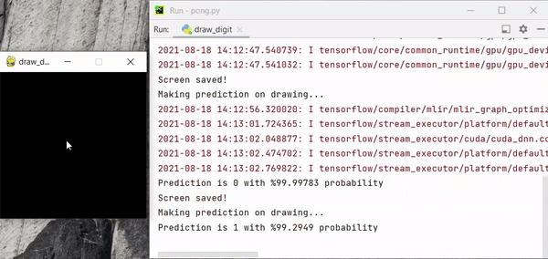
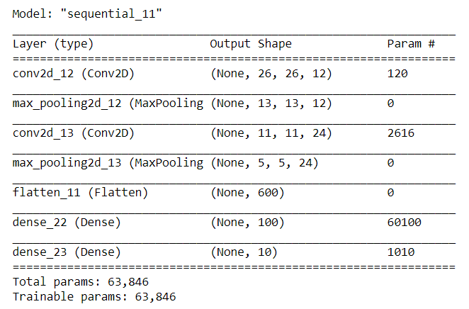
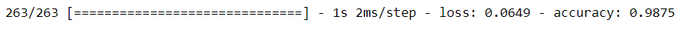

# digit-recognizer

### App that recognizes hand-written digits. CNN trained on famous MNIST dataset, GUI created with python.

Dataset : https://www.kaggle.com/c/digit-recognizer/data

# In-App

# Convolutional Neural Network Architecture

# Evaluation 

